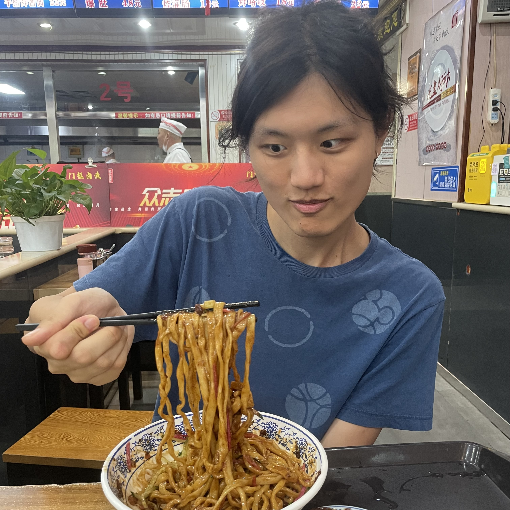

# Han's Page

## About Me

 
I'm **Linghan Zhong**, an undergrad at USC studing CS and Mathematics. Currently, I'm doing research at [CLVR](https://www.clvrai.com/)(Cognitive Learning for Vision and Robotics Lab) lab under the guidance of Professor [Joseph Lim](https://viterbi-web.usc.edu/~limjj/).

## Research

I'm interested in program synthesis and general tasks that reqires models to reason. 

## Publications

- **Hierarchical Neural Program Synthesis**
 
  **Linghan Zhong**, Ryan Lindeborg, Jesse Zhang, Joseph J Lim, and Shao-Hua Sun

  In Submission to ICLR 2023

- **Policy Transfer across Visual and Dynamics Domain Gaps via Iterative Grounding**
  
  Grace Zhang, **Linghan Zhong**, Youngwoon Lee, Joseph J. Lim

  **RSS 2021**
  
  [[PDF](http://www.roboticsproceedings.org/rss17/p006.pdf)] [[Code](https://github.com/clvrai/idapt)] [[Website](https://clvrai.github.io/idapt/)]

## Research Projects

- **Program Synthesis through Contrastive Learning on Auxiliary Data (On-going)**
  
  This project tries to learn a program synthesis model by taking advantage of auxiliary data from each task (e.g. flow chart of program, examples of failed programs). We aim to develop a contrastive learning method to create a joint embedding space for all types of data, which is used for downstream tasks.

- **Hierarchical Framework for Program Synthesis (On-going)**
  
  In this work, we present a program synthesis framework that synthesizes a program by hierarchically composing sub-programs. This way we can build scalable program synthesis models to generate long programs with complex behaviors.

- **Policy Transfer across Visual and Dynamics Domain Gaps**
  
  This project aims to transfer robotics policy from a training environment to a target environment where domain gap exists both visually (e.g. lighting, viewpoint, clutter, and background) and dynamically (e.g. the mass of objects and calibration of the robot).

## Teaching

- **CSCI 310 Software Engineering**
  
  Course Producer

  Spring 2022

## Other Projects

- [I Will Not Make Any More Boring Art](https://github.com/thoughtp0lice/i_will_not_make_any_more_boring_art)
  
  A python implementation of modern art work [I Will Not Make Any More Boring Art](https://www.moma.org/learn/moma_learning/john-baldessari-i-will-not-make-any-more-boring-art-1971/) by John Baldessari.
- [Technicolor Filter](https://github.com/thoughtp0lice/technicolor_filter)
  
  This package try to recreate the process of technicolor filming and allows you to use different shades of cyan, magenta, and yellow to edit your own picture like the film makers in old Hollywood.

## Contact

email: linghanz@usc.edu
