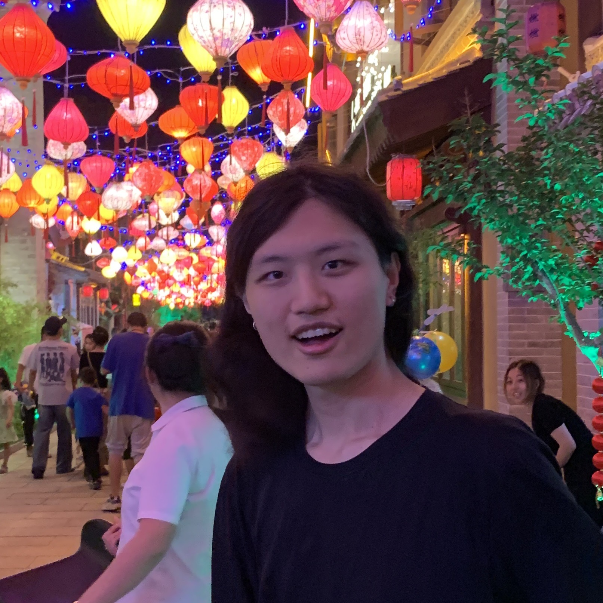

# Han's Page

## About Me

 
I'm an Ph.D. student at UT-Austin advised by Professors [Işıl Dillig](https://www.cs.utexas.edu/~isil/) and [Swarat Chaudhuri](https://www.cs.utexas.edu/~swarat/). I completed my undergrad at USC, where I worked with Professors [Joseph Lim](https://clvrai.com/web_lim/) at USC and [Shaohua Sun](https://shaohua0116.github.io/) now at National Taiwan University.

## Research

I'm interested in program synthesis and general tasks that reqires models to reason. 

## Publications

- **Hierarchical Neural Program Synthesis**
 
  **Linghan Zhong**, Ryan Lindeborg, Jesse Zhang, Joseph J Lim, and Shao-Hua Sun

  Preprint 2023

  [[PDF](https://arxiv.org/abs/2303.06018)] [[Website](https://thoughtp0lice.github.io/hnps_web/)]

- **Policy Transfer across Visual and Dynamics Domain Gaps via Iterative Grounding**
  
  Grace Zhang, **Linghan Zhong**, Youngwoon Lee, Joseph J. Lim

  RSS 2021
  
  [[PDF](http://www.roboticsproceedings.org/rss17/p006.pdf)] [[Code](https://github.com/clvrai/idapt)] [[Website](https://clvrai.github.io/idapt/)]

## Teaching

- **CSCI 310 Software Engineering**
  
  Course Producer

  Spring 2022

## Misc 

- [I Will Not Make Any More Boring Art](https://github.com/thoughtp0lice/i_will_not_make_any_more_boring_art)
  
  A python implementation of modern art work [I Will Not Make Any More Boring Art](https://www.moma.org/learn/moma_learning/john-baldessari-i-will-not-make-any-more-boring-art-1971/) by John Baldessari.
- [Technicolor Filter](https://github.com/thoughtp0lice/technicolor_filter)
  
  This package try to recreate the process of technicolor filming and allows you to use different shades of cyan, magenta, and yellow to edit your own picture like the film makers in old Hollywood.

- [Han and the Telescreen](https://thoughtp0lice.github.io/my_blog/)

  A blog that I wrote for a writing class from September to December 2022. I mainly covered trending tech news during that time.

## Contact

email: linghanz@cs.utexas.edu
